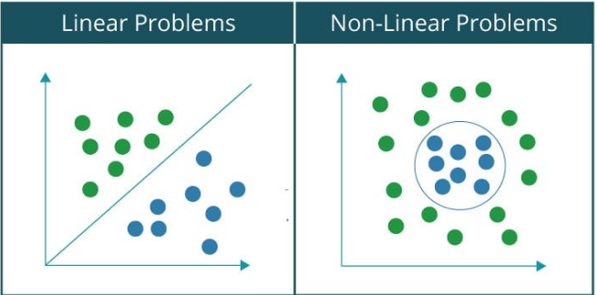
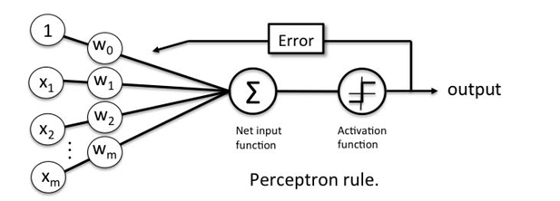
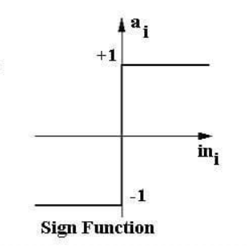

# Perceptron

A Perceptron is an algorithm for Supervised Learning of binary classifiers which enables us to distinguish between the two linearly separable classes i.e. +1 and -1.

Supervised Learning is when the model is getting trained on a labelled dataset which have both input and output parameters. A problem is said to be linearly separable if you can classify the data set into two categories or classes using a single line. For example, separating cats from a group of cats and dogs. On the contrary, in case of a non-linearly separable problems, the data set contains multiple classes and requires non-linear curve for separating them into their respective classes. For example, classification of handwritten digits.

## Perceptron Learning Algorithm

Steps to perform a perceptron learning algorithm:

1. Feed the features of the model that is required to be trained as input in the first layer.
2. All weights and inputs will be multiplied – the multiplied result of each weight and input will be added up.
3. The Bias value will be added to shift the output function.
4. This value will be presented to the activation function (the type of activation function will depend on the need).
5. The value received after the last step is the output value.

### Convergence Theorem
`Convergence Proof - Rosenblatt, Principles of Neurodynamics, 1962.`

If the exemplars used to train the perceptron are drawn from two linearly separable classes, then the perceptron algorithm converges and positions the decision surface in the form of a hyperplane between the two classes.
e.g. In 2 dimensions: We start with drawing a random line. If some point is on the wrong side, we shift the line. If some other point is now on the wrong side, we shift the line again, and we continue this process until the line separates all the points correctly. In other words, the perceptron learning algorithm converges in finite number of steps, given a linearly separable dataset. 

## An Example: Implementation of two input Logic Gates using Perceptron

As we know, a Perceptron calculates a weighted sum of its inputs and thresholds it with a step function. Geometrically, this means the perceptron can separate its input space with a line (for 2D input) or an hyperplane (for 3D input). That’s where the notion that a perceptron can only separate linearly separable problems came from. 

And hence, as shown in the below figure, basic logic gates like AND & OR gates can be easily implemented using Perceptron since they are Linearly Separable but the **XOR function is not linearly separable, and therefore it really is impossible for a single line to separate it**. In this notebook, I'll be constructing Logic gates using a Single-layer Perceptron Neural Network and prove this claim in Julia.

Mathematically, we can represent a perceptron as a function of weights, inputs and bias (vertical offset):

`f(x) = w.x + b`

where,

f(x) = Transfer Function; 
w = Weight Vector; 
x = Input Vector; 
b = Bias; 

- Each of the input received by the perceptron has been weighted based on the amount of its contribution for obtaining the final output. 
- Bias allows us to shift the decision line so that it can best separate the inputs into two classes.

## Activation function

The activation function applies a Sign Function which outputs +1 or -1 depending on whether neuron output is greater than zero or not.

## Results:
- Got 100% Accuracy for OR gate.
- Got 100% Accuracy for AND gate.
- Got 100% Accuracy for NOT gate.
- Got around 50% Accuracy for XOR gate. 

## Observations:
Hence, a Single Layer perceptron can't implement XOR. The reason is because the classes in XOR are not linearly separable. We cannot draw a straight line to separate the points (-1,-1),(1,1) from the points (-1,1),(1,-1).

## Solution:
- An obvious solution is to stack multiple perceptrons together. Although, there is a problem with that. When Rosenblatt introduced the perceptron, he also introduced the perceptron learning rule (the algorithm used to calculate the correct weights for a perceptron automatically). The rule didn’t generalize well for multi-layered networks of perceptrons, thus making the training process of these machines a lot more complex and, most of the time, an unknown process. This limitation ended up being responsible for a huge disinterest and lack of funding of neural networks research for more than 10 years.
> Ref: https://en.wikipedia.org/wiki/Perceptrons_(book)

- In 1986, a paper entitled *Learning representations by back-propagating errors by David Rumelhart and Geoffrey Hinton* changed the history of neural networks research. It introduced a ground-breaking learning procedure: **The Backpropagation Algorithm**. The paper proposed the usage of a differentiable function instead of the step function as the activation for the perceptron. With this modification, a multi-layered network of perceptrons would become differentiable. Hence, gradient descent could be applied to minimize the network’s error and the chain rule could “back-propagate” proper error derivatives to update the weights from every layer of the network.
>Ref: https://www.iro.umontreal.ca/vincentp/ift3395/lectures/backprop_old.pdf
